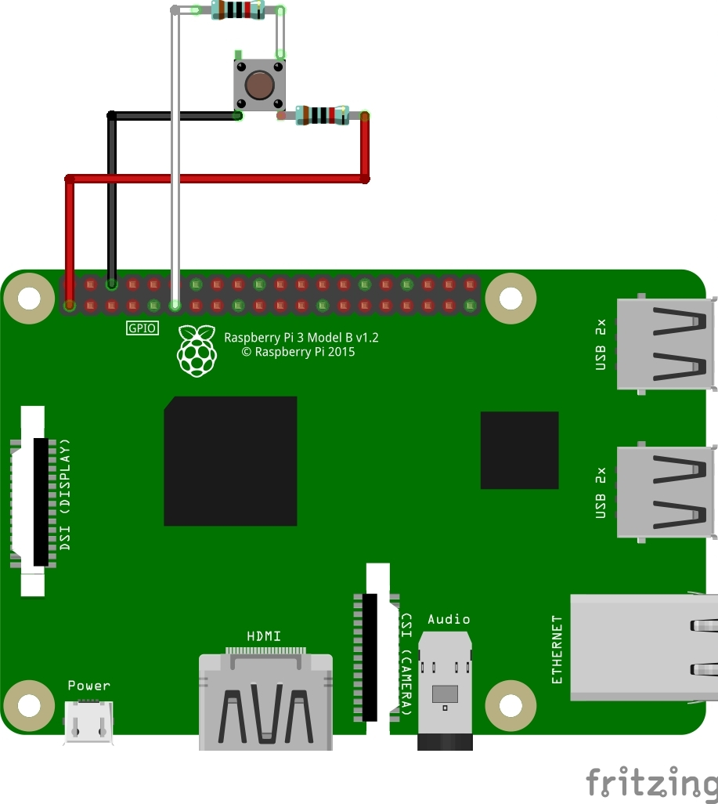
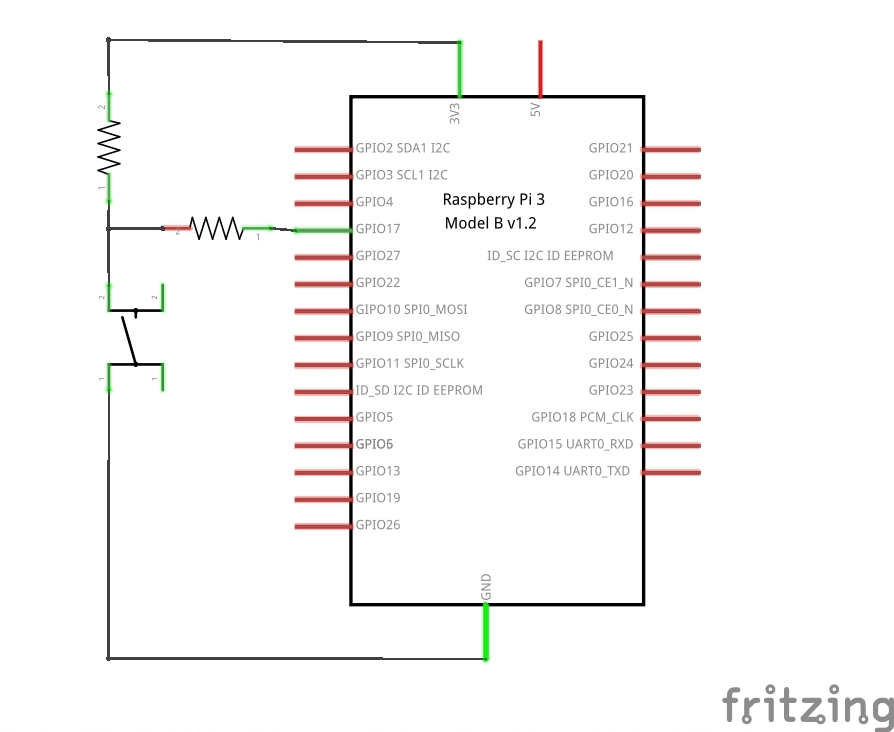
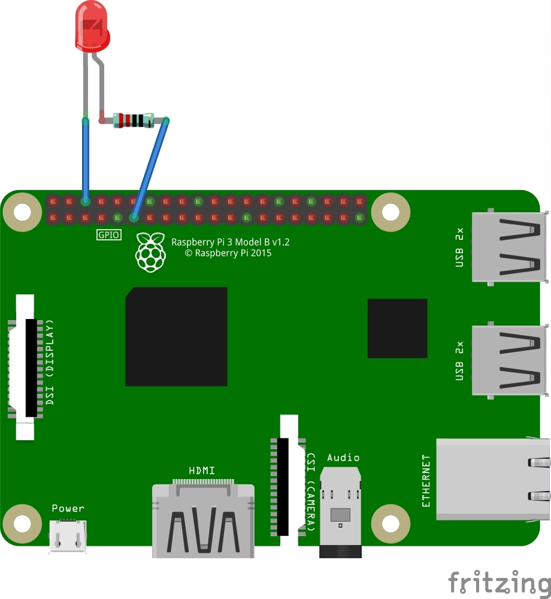
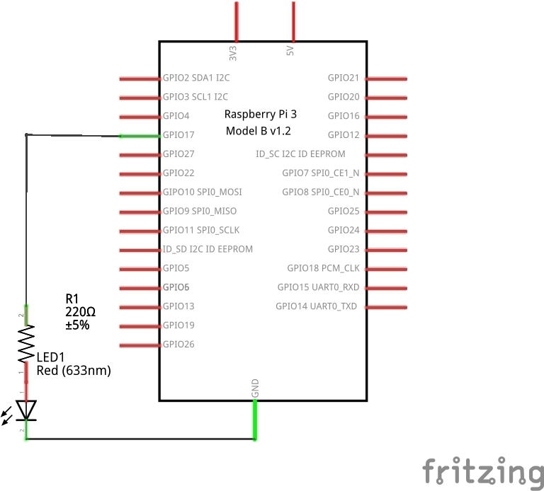
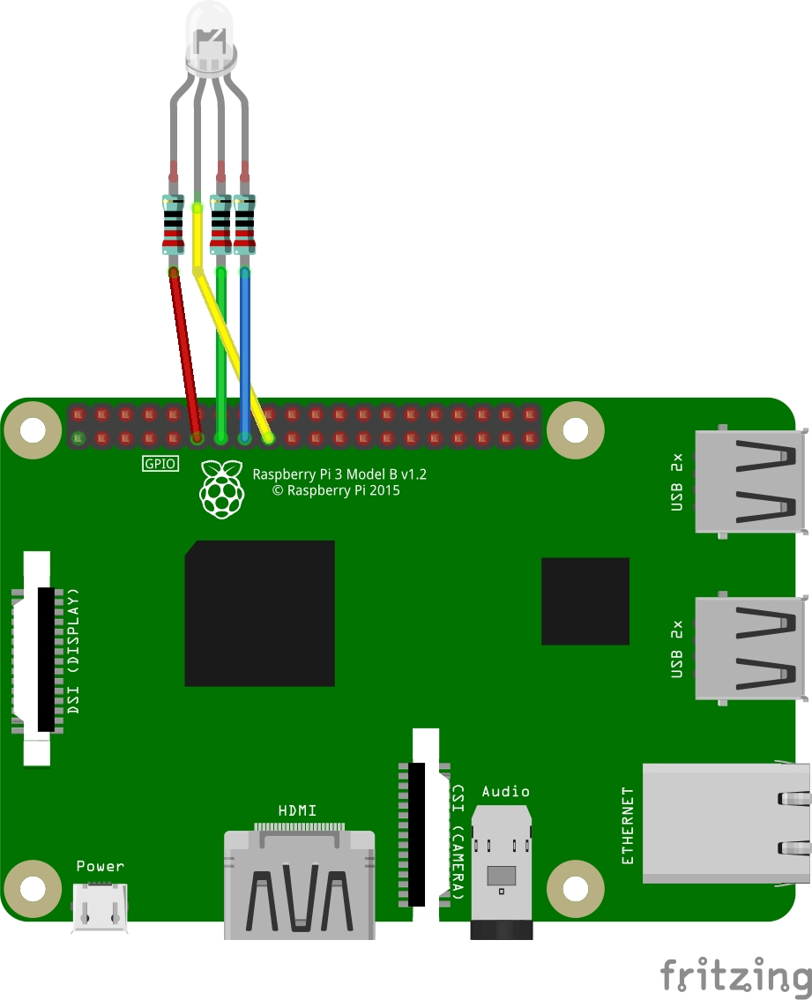
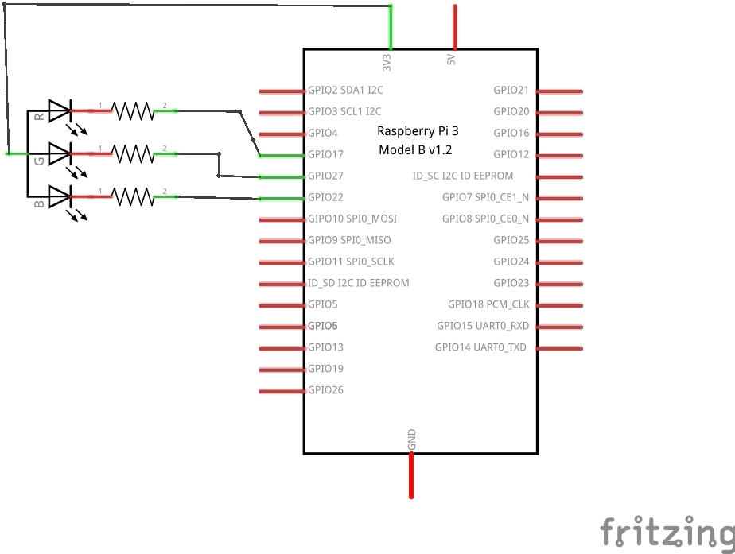

==============================================
Welcome to **raspi_components** documentation!
==============================================

This python library is designed to ease the process of working with
different components connected to the raspberry pi via its gpio.

Features
--------

This library can work with components such as:

- Buttons
- LEDs
- RGB LEDs
- Active Buzzers
- PCF8591
- Potentiometers
- Photoresistors
- Thermistors
- Joysticks

Installation
------------

To install raspi_components, run:

    pip install raspi_components

Working with the library
------------------------
To import the library, run:

.. code-block:: python

    import raspi_components

The Button class:
-----------------

Wiring examples:

Class overview:

.. code-block:: python

    button = raspi_components.Button(pin)
    # This initiates the button class on the chosen pin.

    print(button.is_pressed())
    # Will return True if the button is pressed, otherwise will return False.

    raspi_components.ButtonTest.test(pin)
    # This is a test class, and will loop through, printing whether the button is
    # pressed or not every second.

The Led class:
--------------

Wiring examples:

Class overview:

.. code-block:: python

    led = raspi_components.Led(pin)
    # This initiates the LED on the chosen pin.

    led.on(100)
    # This turns the LED on and sets the brightness to 100%.
    # You can have any value between 0 and 100 here. If left
    # Blank the default value is 100.

    led.off()
    # This turns the LED off.

    led.dim(brightness)
    # This dims the LED. You can have any value from 0 to 100 here.

    raspi_components.LedTest.test(pin)
    # This is a test class, it will loop through turning the LED on and off,
    # and dimming it.

The RGBLed class:
-----------------

Wiring examples:

Class overview:

.. code-block:: python

    rgb_led = raspi_components.RGBLed(red_pin, green_pin, blue_pin)
    # This initiates the RGB LED, taking the input of the chosen pins for
    # red, green, and blue.

    rgb_led.on(red_val, green_val, blue_val)
    # This turns the RGB LED on. red_val, green_val, and blue_val are set to 0
    # by default, but this can be changed to change the color set when turned on.
    # These values can be between 0 and 100.

    rgb_led.set_color(red_val, green_val, blue_val)
    # This changes the color of the RGB LED. These values can be between 0 and 100.

    rgb_led.off()
    # This will turn the RGB LED off.

    raspi_components.RGBLedTest.test(red_pin, green_pin, blue_pin)
    # This is a test class, it will turn the RGB LED on and off, and randomly assign
    # it a color.

The Buzzer class:
-----------------

    Wiring examples:

    .. image:: schems/buzzer_bb.jpg
      :width: 300
      :alt: breadboard
    .. image:: schems/buzzer_schem.jpg
      :width: 325
      :alt: schem

    Class overview:

    .. code-block:: python

        buzzer = raspi_components.Buzzer(pin)
        # This initiates the buzzer class on the chosen pin.

        buzzer.on()
        # This will turn the buzzer on.

        buzzer.off()
        # This will turn the buzzer off.

        BuzzerTest.test(pin)
        # This is the test class for the buzzer. When initialized it will
        # turn the buzzer on for one second.

The ADC class:
--------------

    Wiring examples:

    .. image:: schems/ADC_bb.jpg
        :width: 300
        :alt: breadboard
    .. image:: schems/ADC_schem.jpg
          :width: 325
          :alt: schem

    Class overview:

    .. code-block:: python

        adc = raspi_components.PCF()
        # This initiates the PCF class.

        adc.is_connected()
        # Checks to see if the adc is connected. Raises an error if it is not.

        adc.close()
        # Closes the adc connection.

        value = adc.read(channel)
        # Returns the value from a given channel.

        adc.write(channel, value)
        # Writes the specified value to the given channel.

The VariableResistor class:
---------------------------

This works with potentiometers, photoresistors and thermistors.

    Wiring examples:

    .. image:: schems/potentiometer_bb.jpg
        :width: 300
        :alt: breadboard
    .. image:: schems/potentiometer_schem.jpg
        :width: 325
        :alt: schem

    .. image:: schems/photoresistor_bb.jpg
        :width: 300
        :alt: breadboard
    .. image:: schems/photoresistor_schem.jpg
        :width: 325
        :alt: schem

    .. image:: schems/thermistor_bb.jpg
        :width: 300
        :alt: breadboard
    .. image:: schems/thermistor_schem.jpg
        :width: 325
        :alt: schem

    Class overview:

    .. code-block:: python

        resistor = raspi_components.VariableResistor(channel)
        # This initiates the VariableResistor class on the given channel.

        Value, Voltage, Resistance = resistor.read()
        # Returns the value of the resistor as well as the voltage and the resistance.

        temp = resistor.temp(Resistance)
        # This is to be used with the thermistor. It takes the given resistance from
        # the thermistor and returns the temperature.

        resistor.close()
        # Closes the ADC connection.

The Joystick class:
-------------------

    Wiring examples:

    .. image:: schems/Joystick_bb.jpg
        :width: 300
        :alt: breadboard
    .. image:: schems/Joystick_schem.jpg
        :width: 325
        :alt: schem

    Class overview:

    .. code-block:: python

        joystick = raspi_components.Joystick(xChannel, yChannel, zPin)
        # This initiates the Joystick class. The X and Y are read through the ADC, and the z value is read through a pin.

        x, y, z = joystick.read()
        # This returns the x, y, and z values read from the specified joystick.

        joystick.close()
        # This closes the connection to the ADC.

Contribute
----------

- `Issue Tracker <https://github.com/Builder212/raspi_components/issues>`_
- `Source Code <https://github.com/Builder212/raspi_components/>`_
- `Documentation <https://raspi-components.readthedocs.io/en/latest/?#>`_
- `Package on PyPi <https://pypi.org/project/raspi-components/>`_

Support
-------

If you are having issues, or would like to request a feature,
please open an issue on the repository.

License
-------

This project is licensed under the MIT license.
